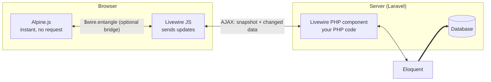
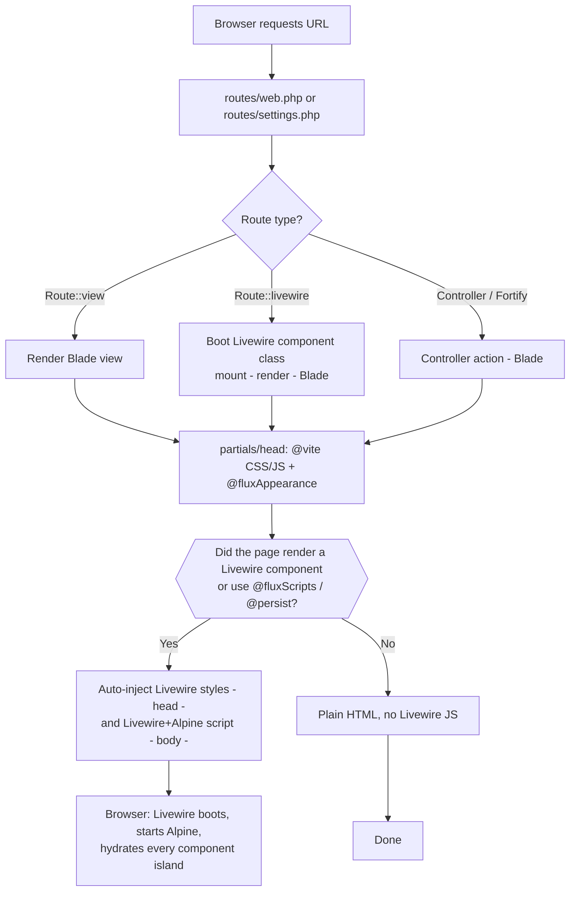
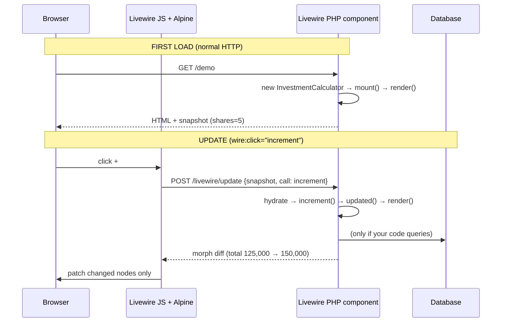
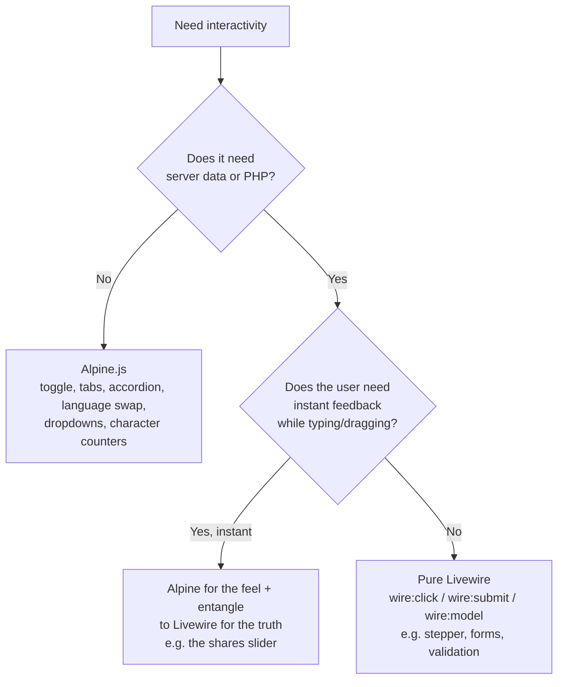
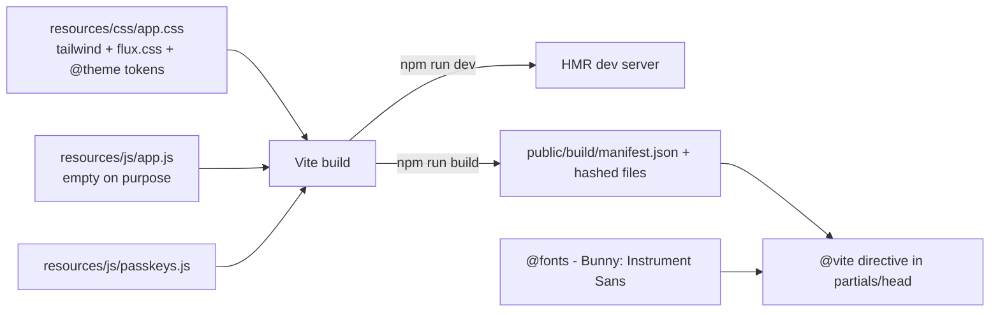

# Laravel 13 + Livewire + Alpine.js — Step-by-Step Guide for This Project

> Written for a Laravel backend developer who is new to Livewire, Alpine.js, and
> component-based Blade. Every example points at a real file in **this repo**
> (`D:\b7landmark`), so you can read the doc and the code side by side.
>
> Conventions in this doc: file paths are relative to the project root.
> `⚡` in a filename (e.g. `⚡profile.blade.php`) marks a single-file Livewire
> page component — explained in §9.

---

## 0. The one-paragraph mental model

Classic Laravel: the browser asks for a page → a route runs → Blade renders HTML →
done. Any interactivity after that is JavaScript **you** write (fetch, jQuery, Vue…).

This project adds two layers on top of that, and they split the job:

- **Alpine.js** = interactivity that needs **no server**. Toggling tabs, opening a
  modal, switching EN/বাংলা text, a FAQ accordion. Runs 100% in the browser.
- **Livewire** = interactivity that needs the **server**. Computing a price from
  the database, validating a form, saving a model. You write PHP, Livewire
  handles the AJAX + DOM patching for you.



Rule of thumb you can use from day one: **if it doesn't need PHP, use Alpine.
If it needs PHP, use Livewire. If it needs both, bridge them with `$wire.entangle`.**
(Decision flowchart in §6.)

---

## 1. What each piece is (and where it lives in this repo)

| Piece | Version here | What it does | Proof in repo |
|---|---|---|---|
| Laravel Framework | `^13.17` | Routing, Eloquent, auth, Blade, queue… the foundation | `composer.json`, `bootstrap/app.php` |
| Livewire | `^4.1` | Server-driven components: write PHP + Blade, get AJAX interactivity without writing JS | `app/Livewire/InvestmentCalculator.php`, `resources/views/livewire/` |
| Alpine.js | bundled **inside** Livewire 4's JS | Tiny client-side reactive layer (`x-data`, `x-show`, `@click`) | Verified: `Alpine` is referenced in `vendor/livewire/livewire/dist/livewire.csp.esm.js`. There is deliberately **no** `alpinejs` in `package.json` — do not add it, you'd initialise Alpine twice |
| Flux | `^2.13.1` | UI kit (`<flux:button>`, `<flux:input>`, sidebar, modal, toast…) built for Livewire | `resources/views/layouts/`, `vendor/livewire/flux/` |
| Blaze | `^1.0` | Compiles anonymous Blade components to plain PHP for speed | `composer.json` (installed; enabling it in `AppServiceProvider` is an optional later step) |
| Tailwind CSS | `^4` (CSS-first config) | Utility styling. **No `tailwind.config.js`** — theme lives in CSS | `resources/css/app.css` (`@theme`, `@source`) |
| Vite (+ vite-plus) | `^8` | Dev server + production asset build | `vite.config.js`, `package.json` (`vp dev` / `vp build`) |
| Fortify | `^1.37.2` | Backend auth (login, register, 2FA, passwords). The auth **views** are Livewire/Flux pages | `app/Providers/FortifyServiceProvider.php`, `resources/views/pages/auth/` |
| Pest | `^5.1` | Test runner | `tests/` |

---

## 2. Install & run this project

### 2.1 Prerequisites

- PHP `^8.3` (`php -v`)
- Composer 2 (`composer -V`)
- Node 20+ + npm (`node -v`)
- A database. `.env` is currently configured for **MySQL**: `DB_DATABASE=b7`,
  user `root`, empty password. Either create that database, or switch to SQLite
  (see below).

### 2.2 Fresh install (clone → running)

```powershell
composer install
Copy-Item .env.example .env
php artisan key:generate
```

Database — pick one:

```powershell
# Option A: MySQL (matches current .env) — create the `b7` database first, then:
php artisan migrate

# Option B: SQLite (simplest for learning, no server needed)
# in .env set: DB_CONNECTION=sqlite  (and remove the DB_HOST/PORT/DATABASE/USERNAME/PASSWORD lines)
New-Item -ItemType File database/database.sqlite -Force
php artisan migrate
```

Then frontend + serve (three things, one command — see §2.4):

```powershell
npm install
composer dev
```

`composer dev` runs `php artisan serve` + `queue:listen` + `npm run dev`
concurrently. Open `http://127.0.0.1:8000`, and the demo page at
`http://127.0.0.1:8000/demo`.

Production build:

```powershell
npm run build
php artisan route:cache
php artisan view:cache
php artisan config:cache
```

### 2.3 `.env` values that matter here

| Key | Current | Why it matters |
|---|---|---|
| `DB_CONNECTION` / `DB_DATABASE` | `mysql` / `b7` | All auth + jobs + cache tables live here |
| `SESSION_DRIVER` | `database` | Sessions need the `sessions` migration — `migrate` is mandatory, not optional |
| `QUEUE_CONNECTION` | `database` | That's why `composer dev` also runs `queue:listen` |
| `CACHE_STORE` | `database` | Same — needs migrated tables |
| `MAIL_MAILER` | `log` | Mails go to `storage/logs/laravel.log` — nothing to configure while learning |

Tests ignore all of the above: `phpunit.xml` forces SQLite `:memory:`, so
`php artisan test` works with no database server.

### 2.4 Scripts cheat sheet

| Command | What it does |
|---|---|
| `composer setup` | Full first-time setup: install → env → key → migrate → npm install → build |
| `composer dev` | Serve + queue + Vite dev server (daily driver) |
| `npm run dev` / `npm run build` | Vite dev / production build only |
| `php artisan test --filter=B7DemoTest` | Run the Livewire demo tests |
| `php artisan pint --parallel` (`composer lint`) | Code style fixer — run before committing PHP |

---

## 3. How a classic page renders (the lifecycle you already know, +1 step)



The `I → J` step is the only new magic, and it's in two vendor files you can read:

1. `SupportAutoInjectedAssets` — after a 200 HTML response, if any Livewire
   component rendered (or `@fluxScripts` forced it via `forceAssetInjection()`),
   it injects `FrontendAssets::styles()` before `</head>` and
   `FrontendAssets::scripts()` (the `/livewire/livewire.js` script tag, which
   **contains Alpine**) before `</body>`.
2. Flux's `AssetManager` (`@fluxScripts` directive) calls
   `app('livewire')->forceAssetInjection()` and loads `/flux/flux.js`.

Practical consequence: **on pages with no Livewire component and no
`@fluxScripts`, there is no Alpine and no Livewire JS.** Our `demo.blade.php`
renders `<livewire:investment-calculator />`, so assets are auto-injected and
`@livewireScripts` at the bottom pins them deterministically.

---

## 4. How Livewire works in the background

### 4.1 First load vs. update

- **First load:** the component class boots on the server (`mount()` →
  `render()`), Blade renders to HTML, and Livewire embeds an encrypted
  **snapshot** (component name + public property values) in the HTML.
- **Update** (e.g. `wire:click="increment"`): Livewire JS sends the snapshot +
  the triggered action to `POST /livewire/update`. Laravel re-hydrates your PHP
  object, runs the action, re-renders Blade, and returns an HTML **diff**
  ("morph"). The browser patches only changed nodes — no full reload.



### 4.2 Anatomy of a Livewire component (our real example)

Class: `app/Livewire/InvestmentCalculator.php` — View:
`resources/views/livewire/investment-calculator.blade.php`.

```php
class InvestmentCalculator extends Component
{
    public int $shares = 5;          // ① public property = reactive state
    public int $pricePerShare = 25000;

    public function increment(): void // ② action = method called from Blade
    {
        $this->shares++;
    }

    #[Computed]                      // ③ derived value, cached per request
    public function total(): int
    {
        return $this->shares * $this->pricePerShare;
    }

    public function render()          // ④ which Blade view to render
    {
        return view('livewire.investment-calculator');
    }
}
```

```blade
<button type="button" wire:click="increment">+</button>  {{-- ② trigger --}}
<span>{{ $shares }}</span>                               {{-- ① state --}}
<span>৳ {{ number_format($this->total) }}</span>          {{-- ③ computed --}}
```

① **Public properties are the state.** Everything `public` is serialised into
the snapshot on every request — keep them small scalars/arrays, **never**
Eloquent models or huge collections (store IDs, re-query).

② **Actions are plain methods** invoked by `wire:click`, `wire:submit`,
`wire:change`, etc. Each call = one AJAX round-trip.

③ **`#[Computed]` is derived state.** Accessed as `$this->total` (property
syntax) in Blade; Livewire caches it for the request. Note the trap we already
hit once in this repo: inside plain PHP (`updated()` dispatching the event)
you must call it as a **method** — `$this->total()`.

④ **`render()` ties class → view.** Convention: `App\Livewire\Foo` ↔
`resources/views/livewire/foo.blade.php`.

### 4.3 Lifecycle hooks (run automatically)

| Hook | When | Typical use |
|---|---|---|
| `mount()` | Once, on first load | Initialise state, load models |
| `hydrate()` / `dehydrate()` | Every update, before/after | Rarely needed directly |
| `updated($name, $value)` / `updating(...)` | After/before **any** property changes | Side effects. Ours dispatches `calculator-updated` |
| `updatedShares($value)` | After one specific property changes | Per-field logic (validate, reset…) |

### 4.4 The directives you'll use daily

| Directive | Meaning | Example in repo |
|---|---|---|
| `wire:click="method"` | Call action on event | Stepper buttons in `investment-calculator.blade.php` |
| `wire:submit="method"` | Handle form submit (no reload) | `wire:submit="updateProfileInformation"` in `⚡profile.blade.php` |
| `wire:model="prop"` | Two-way bind input ↔ property (server round-trip per change) | `wire:model="name"` in `⚡profile.blade.php` |
| `wire:navigate` | SPA-style navigation, no full reload | Links in layouts/sidebar, logo |
| `wire:loading` / `wire:loading.remove` | Show/hide while a request is in flight | `updating…` indicator next to the total |
| `wire:cloak` | Hidden until Livewire boots (like Alpine's `x-cloak`) | — |
| `@persist('toast')` | Keep element alive across `wire:navigate` page swaps | Toast group in all layouts |
| `$wire.entangle('prop')` | **Bridge**: share one state between Livewire and Alpine (see §5.4) | Range slider in `investment-calculator.blade.php` |

---

## 5. How Alpine.js works

Alpine lives entirely in the browser. No requests, no PHP. Directives are
HTML attributes starting with `x-` or `@`:

| Directive | Meaning | Example in repo |
|---|---|---|
| `x-data="{ open: 1 }"` | Declares a reactive island + its state | FAQ accordion in `demo.blade.php` |
| `x-show="…"` | Toggle visibility | EN/বাংলা spans, FAQ answers |
| `x-text="…"` | Set text content | `+`/`−` icons, slider value |
| `x-model="…"` | Two-way bind an input | Slider bound to entangled `sliderShares` |
| `@click="…"` / `@scroll.window="…"` | Event listeners (`.window` = listen on window) | Header shrink-on-scroll, language buttons |
| `x-cloak` | Hidden until Alpine boots (needs the CSS rule — Livewire's injected styles include it) | FAQ answers |
| `$store.lang` | **Global** reactive state shared across islands | `EN | বাংলা` toggle (all sections read `$store.lang.current`) |
| `$wire` | The Livewire component from inside its own view | `$wire.entangle('shares')` |

### 5.1 The language store (read this — it's the global-state pattern)

In `demo.blade.php`, just before `@livewireScripts`:

```html
<script>
    document.addEventListener('alpine:init', () => {
        Alpine.store('lang', {
            current: localStorage.getItem('b7_lang') || 'en',
            set(lang) {
                this.current = lang;
                localStorage.setItem('b7_lang', lang);
            }
        });
    });
</script>
```

Why it sits **before** `@livewireScripts`: that script tag loads the bundle
that starts Alpine. The `alpine:init` listener must be registered first, or the
event fires before anyone is listening and `$store.lang` never exists. Any
`x-show="$store.lang.current === 'en'"` would then break.

### 5.2 The FAQ accordion (local-state pattern)

```html
<div x-data="{ open: 1 }">
    <button @click="open = (open === 1 ? null : 1)">…</button>
    <div x-show="open === 1" x-cloak>…answer…</div>
</div>
```

`x-data` scopes state to that `<div>`; nothing leaves the browser.

### 5.3 Alpine + Flux

Flux components accept Alpine directives directly. The appearance switcher in
`resources/views/pages/settings/⚡appearance.blade.php` binds a radio group
straight to Flux's own Alpine magic property:

```blade
<flux:radio.group x-data variant="segmented" x-model="$flux.appearance">
```

### 5.4 The bridge: `$wire.entangle`

The slider in `investment-calculator.blade.php`:

```blade
<div x-data="{ sliderShares: $wire.entangle('shares') }">
    <input type="range" min="1" max="50" x-model.number="sliderShares">
</div>
```

Dragging updates Alpine instantly **and** syncs to Livewire's `shares`
(debounced server update → total recomputes). Two gotchas:

1. `$wire` only exists **inside that component's own view** — not in the parent
   page, not in a sibling component.
2. `entangle` syncs on change; dragging a slider can fire many updates. For
   expensive server work prefer `.live` sparingly or a "commit on release"
   pattern.

---

## 6. Which tool for which job



| Situation | Correct choice | Wrong choice |
|---|---|---|
| FAQ accordion, mobile menu, language toggle | Alpine | Livewire (wastes a request per click) |
| Price total, form validation, DB search | Livewire | Alpine + hand-rolled fetch (rebuilds what Livewire gives free) |
| Slider that recomputes a server total | Alpine `x-model` + `$wire.entangle` | `wire:model` on a range input (a request per pixel dragged) |
| Static content, SEO-critical copy | Plain Blade | Wrapping everything in components "just in case" |

---

## 7. Project configuration tour

### 7.1 Bootstrap — `bootstrap/app.php` + `bootstrap/providers.php`

`bootstrap/app.php` is the slim Laravel 11+ style: routing (`routes/web.php`,
`routes/console.php`, health `/up`), middleware and exceptions in one file.
Providers are listed in `bootstrap/providers.php`:

- `AppServiceProvider` — app defaults (immutable dates, destructive-DB guard in
  production, password rules). This is also where you'd enable Blaze
  optimisation later (`Blaze::optimize()->in(...)`).
- `FortifyServiceProvider` — wires Fortify actions (`CreateNewUser`,
  `ResetUserPassword` in `app/Actions/Fortify/`) to the Blade views, plus login
  rate limiting.

### 7.2 Routes — `routes/web.php` + `routes/settings.php`

Three flavours, all present here:

```php
Route::view('/', 'welcome')->name('home');      // plain Blade, no PHP
Route::view('/demo', 'demo')->name('demo');     // plain Blade HOSTING a Livewire island

Route::middleware(['auth', 'verified'])->group(function () {
    Route::view('dashboard', 'dashboard')->name('dashboard');
});

// settings.php — full Livewire pages:
Route::livewire('settings/profile', 'pages::settings.profile')->name('profile.edit');
```

`Route::livewire(uri, component)` serves a component as a whole page.
`pages::` is the component namespace this starter kit registers for views under
`resources/views/pages/`. Nested component: `<livewire:pages::settings.delete-user-form />`.

### 7.3 Config — `config/`

Standard Laravel configs (`app`, `auth`, `database`, `session`, `fortify`…).
Note: **there is no `config/livewire.php`** — Livewire runs on defaults (asset
injection on, default update endpoint). Only publish one (`php artisan
livewire:publish --config`) when you need to change a default.

### 7.4 Frontend pipeline — `vite.config.js`, `package.json`, `resources/`



- `resources/js/app.js` is **empty by design**: Livewire + Alpine arrive via the
  PHP-served `/livewire/livewire.js`, not the npm bundle. Only put truly global
  custom JS here (and only after understanding `wire:navigate`, which persists
  the page between navigations — global listeners can double-attach; prefer
  Alpine `x-init` or `livewire:navigated` events).
- `@vite(['resources/css/app.css', 'resources/js/app.js'])` lives in
  `resources/views/partials/head.blade.php`, included by every layout — one
  place to change.
- In tests there is no Vite build, so `B7DemoTest` calls `$this->withoutVite()`.
  Copy that `beforeEach` into any test that renders a page using `@vite`.

---

## 8. Folder structure (annotated)

```text
app/
  Actions/Fortify/      CreateNewUser, ResetUserPassword (called by Fortify, not by you directly)
  Concerns/             Shared validation rules (ProfileValidationRules, PasswordValidationRules)
  Http/Controllers/     Almost empty — Livewire components replaced most controllers
  Livewire/             Class-based Livewire components (InvestmentCalculator + Actions/Logout)
  Models/               Eloquent models (User)
  Providers/            AppServiceProvider, FortifyServiceProvider

resources/
  css/app.css           Tailwind v4 entry: imports, @theme brand tokens, Flux tweaks
  js/app.js             Empty (see §7.4) · passkeys.js for WebAuthn
  views/
    demo.blade.php              ★ The Alpine+Livewire demo page (start here)
    welcome.blade.php           Default Laravel landing (plain Blade)
    dashboard.blade.php         Authed landing (Flux layout + placeholders)
    livewire/                   Views for class components (investment-calculator)
    pages/                      ★ Single-file Livewire pages (auth/*, settings/⚡*)
    layouts/                    app.blade.php (+ app/sidebar|header variants), auth*.blade.php
    components/                 Anonymous Blade components (<x-app-logo/>, <x-auth-header/>…)
    partials/head.blade.php     Shared <head>: meta, @fonts, @vite, @fluxAppearance
    flux/                       Published Flux icon overrides

routes/                 web.php (public + dashboard), settings.php (Route::livewire pages)
config/                 No livewire.php (defaults); fortify.php drives auth features
database/
  migrations/           users, cache, jobs, passkeys, two-factor columns
  seeders/              DatabaseSeeder (test user)
tests/Feature/          B7DemoTest (Livewire tests) · Auth/* · Settings/* · DashboardTest
docs/                   B7Hotel product docs + this guide
```

### Where does new code go?

| I want to… | Put it… |
|---|---|
| New marketing/investor section (static) | Section in `demo.blade.php`, or a new plain view + `Route::view` |
| New server-interactive widget | `app/Livewire/X.php` + `resources/views/livewire/x.blade.php`, embed with `<livewire:x />` |
| New full authed page with form | Single-file page in `resources/views/pages/…` + `Route::livewire` in `routes/settings.php` (copy `⚡profile.blade.php`) |
| Reusable static UI chunk | `resources/views/components/x-card.blade.php`, use as `<x-x-card />` |
| New Eloquent model + table | `php artisan make:model X -m`, migration in `database/migrations/`, register route/component as above |
| Brand/design change | `resources/css/app.css` `@theme` tokens (never hard-code hex in views) |

---

## 9. The three component kinds (the "new code style")

### Kind 1 — Anonymous Blade components (`resources/views/components/`)

Pure presentational chunks, no PHP class. Props via `@props`:

```blade
{{-- usage: <x-auth-header title="…" description="…" /> --}}
```

Use for: logos, headers, placeholders, anything static. Cheapest option —
prefer it unless you need Kind 2 or 3.

### Kind 2 — Class-based Livewire components (`app/Livewire/` + `resources/views/livewire/`)

Stateful + server-interactive. `InvestmentCalculator` is the reference.
Create with `php artisan make:livewire InvestmentCalculator` (creates both
files). Embed with `<livewire:investment-calculator />`.

### Kind 3 — Single-file Livewire pages (`resources/views/pages/**/⚡*.blade.php`)

Component class **and** view in one file — the `⚡` files. Pattern (from
`⚡profile.blade.php`):

```blade
<?php
use Livewire\Component;
use Livewire\Attributes\Title;

new #[Title('Profile settings')] class extends Component {
    public string $name = '';

    public function mount(): void
    {
        $this->name = auth()->user()->name;   // init on first load
    }

    public function save(): void
    {
        $this->validate([/* rules */]);       // server-side validation
        // …persist…
    }
}; ?>

<section>
    <form wire:submit="save">
        <flux:input wire:model="name" :label="__('Name')" />
        <flux:button variant="primary" type="submit">{{ __('Save') }}</flux:button>
    </form>
</section>
```

Top half = PHP component (imports, state, actions). Bottom half = Blade view
using `wire:*` + `<flux:*>`. Served via `Route::livewire(...)`, never via
`Route::view` (a plain view route would render the PHP block as text context,
not boot the component).

---

## 10. Walkthrough: the demo page, top to bottom

`resources/views/demo.blade.php` + route `Route::view('/demo', 'demo')`:

1. **`<head>`** — `@include('partials.head')` (Vite CSS/JS, Flux appearance) +
   `@livewireStyles` + Google Fonts (Inter + Noto Sans Bengali for the demo's
   bilingual text).
2. **`<html … x-data>`** — a bare `x-data` makes the whole page an Alpine
   scope so `$store` references resolve everywhere.
3. **Header** — pure Alpine: `x-data="{ scrolled: false }"` +
   `@scroll.window` shrinks it; `EN | বাংলা` buttons call
   `$store.lang.set(…)`; zero server traffic.
4. **Hero + stats** — plain Blade (`@foreach` for the six stat cards) with
   Alpine `x-show` per language. Placeholders (`XX Decimal`, `৳ XX,XXX`) stay
   until real data arrives — per the product docs, never invent numbers.
5. **`<livewire:investment-calculator />`** — the Livewire island (§4.2):
   stepper = server round-trip per click; slider = Alpine `x-model` entangled
   to `shares`; total recomputed server-side with `wire:loading` feedback.
6. **FAQ** — pure Alpine accordion (`x-data="{ open: 1 }"`), `x-cloak` prevents
   flash of open answers before Alpine boots.
7. **Footer + `@livewireScripts`** — scripts last; the `alpine:init` store
   registration sits just above so it can't miss Alpine's start.

---

## 11. Flux essentials

- Layouts: `<x-layouts::app>` / `<x-layouts::auth>` wrap pages; `app/sidebar`
  vs `app/header` variants pick navigation style.
- Form kit: `<flux:input>`, `<flux:button>`, `<flux:checkbox>`,
  `<flux:radio.group>`, `<flux:text>`, `<flux:link>`, `<flux:heading>`.
- Overlays/data: `<flux:modal>`, `<flux:dropdown>`, `<flux:toast>`,
  `<flux:sidebar>`, `<flux:navbar>`, `<flux:avatar>`.
- Flux components understand `wire:model`, `wire:click`, `x-data`,
  `x-model="$flux.appearance"` out of the box — never wrap them in extra divs
  to "make Alpine work"; put the directive directly on the Flux tag.
- Required directives per layout: `@fluxAppearance` in `<head>`
  (theme/dark-mode bootstrap), `@fluxScripts` before `</body>` (also forces
  Livewire asset injection — which is why Flux pages always have Alpine
  available).

---

## 12. Styling with Tailwind v4 (CSS-first)

No `tailwind.config.js` in this project. Theme lives in
`resources/css/app.css`:

```css
@import 'tailwindcss';
@import '../../vendor/livewire/flux/dist/flux.css';

@source '../views';   /* scan views for class names */

@theme {
    --color-brand-navy: #0b192c;    /* → class: bg-brand-navy, text-brand-navy… */
    --color-brand-gold: #d4af37;    /* → class: bg-brand-gold, border-brand-gold… */
    --color-brand-ivory: #f9f8f6;
    --color-brand-slate: #4a5568;
    --color-brand-bg: #fcfbfa;
    --font-sans: 'Inter', …;
    --font-bengali: 'Noto Sans Bengali', 'Inter', sans-serif;
}
```

Rules: add a token once in `@theme`, use the generated utility everywhere;
`font-bengali` on every Bengali span (Latin fonts render Bengali poorly);
`@source` must cover any new directory holding Blade files or classes get
purged in production builds.

---

## 13. Database, auth, tests

- **Migrations** (`database/migrations/`): users, `cache`/`jobs` (needed by the
  database cache/queue/session drivers), `passkeys`, two-factor columns.
- **Auth** is Fortify (backend) + Livewire/Flux pages (frontend):
  `FortifyServiceProvider` maps login/register/2FA/password views; actions in
  `app/Actions/Fortify/`; routes come from Fortify itself, views from
  `resources/views/pages/auth/`.
- **Tests** (`tests/Feature/B7DemoTest.php`) show the three Livewire test
  shapes — page render, interaction chain, guard clause:

```php
beforeEach(fn () => $this->withoutVite());   // no Vite build in tests

$this->get(route('demo'))->assertOk()
    ->assertSee('Calculate Your Investment', false)
    ->assertSeeLivewire(InvestmentCalculator::class);

Livewire::test(InvestmentCalculator::class)
    ->assertSet('shares', 5)
    ->call('increment')
    ->assertSet('shares', 6)
    ->assertSee('150,000');
```

---

## 14. Coding standards checklist

**Do**

- ✅ Start static: plain Blade → anonymous `<x-*>` → Alpine → Livewire, in
  that order. Escalate only when the cheaper layer can't do it.
- ✅ One Livewire component = one responsibility; keep public properties tiny
  (IDs + scalars, re-query models).
- ✅ `wire:key` on every element inside `@foreach` loops that contain Livewire
  interactivity (prevents morph mistakes when the list changes).
- ✅ Validate server-side in actions (`$this->validate([...])`) — `wire:model`
  is user input like any request data.
- ✅ Brand values via `@theme` tokens; Bengali text always with `font-bengali`.
- ✅ `x-cloak` on anything Alpine-hides; `wire:loading` on anything
  server-computed.
- ✅ Run `composer lint` (Pint) before committing; add `B7DemoTest`-style tests
  for new components.
- ✅ Disclaimers near investment figures (illustrative, per approved
  documents, no guaranteed returns) — already in the calculator view; copy the
  pattern, don't drop it.

**Don't**

- ❌ `npm install alpinejs` — Alpine ships inside Livewire 4 here; a second
  copy double-boots and breaks `$store`/`$wire`.
- ❌ `wire:model` on high-frequency inputs (range sliders, keystroke search
  without debounce) — entangle or debounce instead.
- ❌ Public properties holding Models/collections — snapshot bloat + stale
  data; store the key, query in `mount()`/computed.
- ❌ `$wire` outside the component's own view, or Alpine stores for
  server-truth (stores reset on navigation; server state doesn't).
- ❌ Inventing project numbers/prices/distances — `XX` placeholders until the
  real documents arrive (product requirement).
- ❌ `Route::view` for a `⚡` single-file page — it must be `Route::livewire`.

---

## 15. Learning path (do these in order, in this repo)

1. **Render loop.** Open `/demo`, read `routes/web.php` → `demo.blade.php` →
   `partials/head.blade.php`. Predict which parts are Blade/Alpine/Livewire,
   then confirm in DevTools (Alpine islands have `x-data`; the calculator root
   has `wire:snapshot`).
2. **Alpine only.** Add a third FAQ item by copying an existing block. Then add
   a mobile menu toggle (`x-data="{ open: false }"`). No PHP touched.
3. **Language store.** Add one new bilingual line using the
   `$store.lang.current` `x-show` pattern + `font-bengali`. Break it on purpose
   (move the `alpine:init` script after `@livewireScripts`, reload, watch it
   fail, move it back) — you'll never forget the ordering rule.
4. **Livewire basics.** Add `reset()` action + button to `InvestmentCalculator`
   (sets `shares = 5`). Cover it with a `Livewire::test` assertion.
5. **Validation.** Turn the contact section into a single-file page component
   with `wire:submit`, `$this->validate([...])`, and a success flag. Model it
   on `⚡profile.blade.php`.
6. **Database wiring.** Create the `investment_packages` table from
   `docs/b7hotel_architecture.md`, seed 3 tiers, and make `pricePerShare` load
   from the DB instead of the hardcoded `25000`. Update `B7DemoTest`.
7. **Full page.** Build a new `Route::livewire` page (e.g. facilities grid)
   combining: Flux layout + anonymous cards + one Alpine island + one Livewire
   island. Get it reviewed against §14.

---

## 16. Troubleshooting

| Symptom | Likely cause | Fix |
|---|---|---|
| `$store.lang is undefined` / `x-show` never toggles | `alpine:init` registered after Alpine started | Registration script must sit **before** `@livewireScripts` |
| `wire:click` does nothing, no network request | No Livewire JS on page (plain view, no component, no `@fluxScripts`) | Render a component or add `@livewireScripts` |
| Page works but tests fail on `@vite` | No build manifest in test env | `$this->withoutVite()` in `beforeEach` |
| `entangle` slider lags / floods requests | Sync per input event | Debounce or commit-on-change instead of live entangle |
| Total shows stale value after action | Read a `#[Computed]` as property in PHP (`$this->total` instead of `$this->total()`) | Method-call syntax in PHP; property syntax only in Blade |
| Styles missing in production | New Blade dir not covered by `@source`; or forgot `npm run build` | Extend `@source`, rebuild |
| 500 on fresh clone | `.env` missing / `b7` DB missing / migrations not run | §2.2 in order; `SESSION_DRIVER=database` requires migrated tables |

---

## 17. Glossary + where to go next

- **Snapshot** — encrypted JSON of component name + public props embedded in
  HTML; sent back on every update so PHP can re-hydrate.
- **Morph** — Livewire's DOM diff/patch; why only changed nodes update.
- **Hydrate/dehydrate** — restoring/saving component state around an update.
- **Entangle** — two-way sync between one Livewire property and one Alpine
  value.
- **`wire:navigate` / `@persist`** — SPA navigation: fetch + morph the page
  instead of reloading; `@persist` keeps elements (toasts, players) alive.
- **Anonymous component** — Blade-only reusable chunk (`<x-*>`), no class.
- **Flux** — Livewire's official component kit (this repo's design system).
- **Blaze** — optional compiler that turns anonymous components into raw PHP
  for speed; installed, enable later in `AppServiceProvider`.
- **Fortify** — headless auth backend; this repo pairs it with Livewire pages.

Further reading: Livewire docs (lifecycle, morphing, navigate, testing) →
Alpine docs (directives, stores, `$wire`) → Flux docs (components, appearance)
→ then `docs/b7hotel_architecture.md` for the database + component blueprint
this demo was built from.
